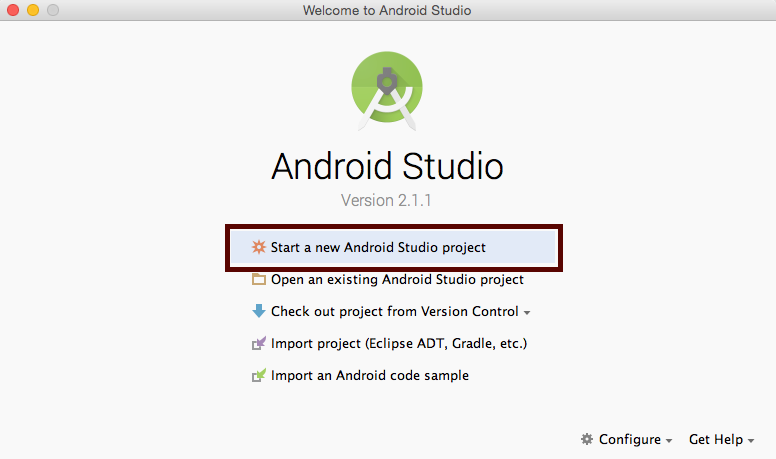
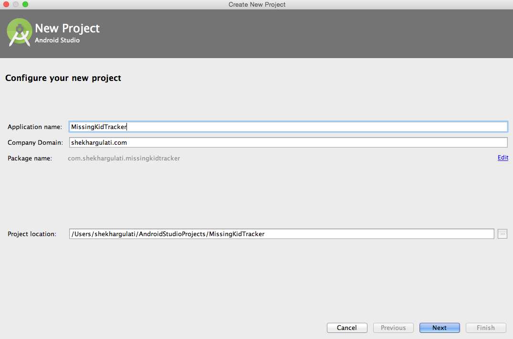
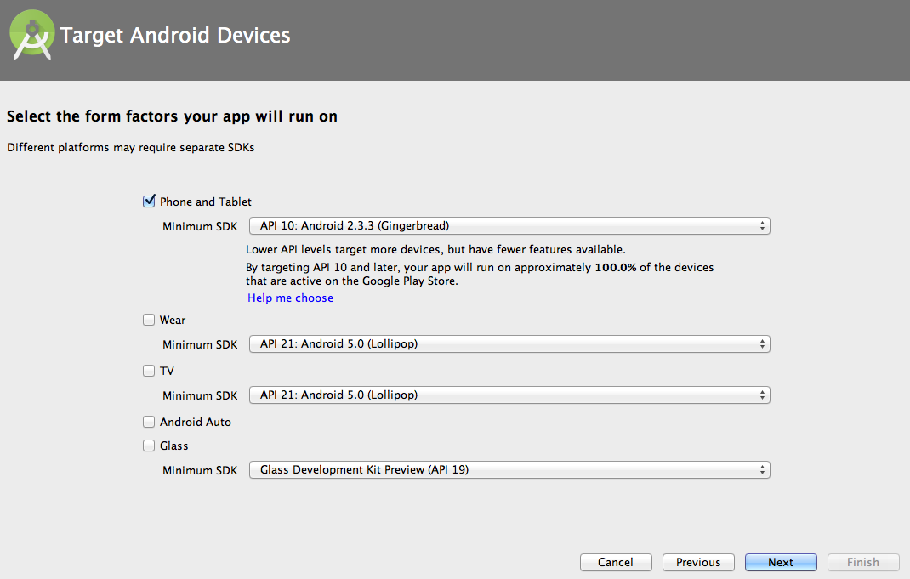
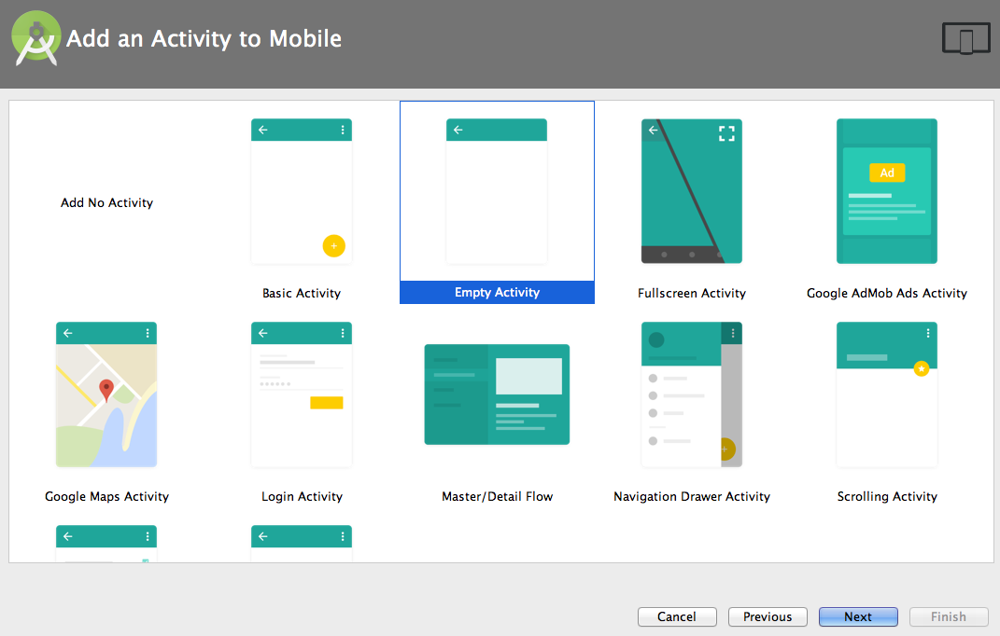
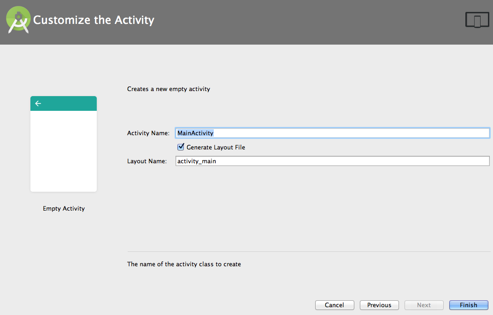
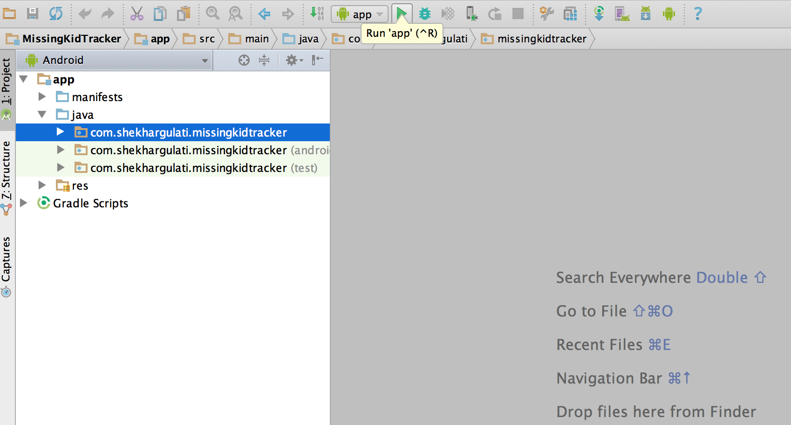
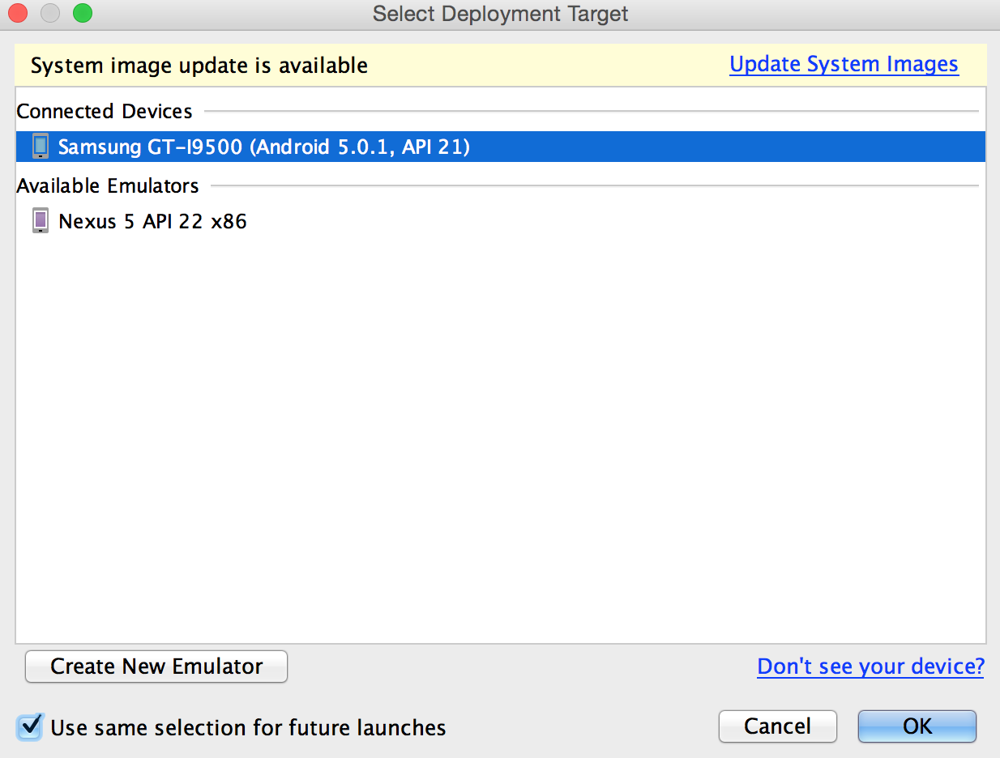
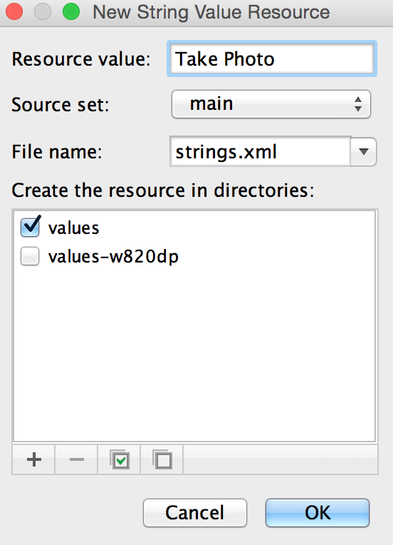

Building An Android Application To Track Missing Kids Part 1
-----

Yesterday, I read an article which talked about an alarming issue of missing children in India. Every year more than 100,000 kids go missing in India. Some of these kids are kidnapped for ransom, some are sexually assaulted and then murdered, some are made traffic light beggars, and some are put into human trafficking. So, I thought about building an application that can help track and locate missing kids. The idea of app is that if you see a kid at places like traffic lights or at other unwanted places then you should take their picture using the app. The application will capture the photo and kid's geolocation and share it with the backend. This data will then be matched against the missing kid reports submitted by parents. If possible match is found then parents will be notified.

I understand that I can't build the full application over one weekend so I will be working on the application throughout June and July. I will write blogs covering different aspect of building an Android application. I am new to Android app development so we will go step by step. This week we will focus on capturing photo, storing photo in an album, and finally showing the captured photo for preview.

> **If you are interested in working on this app with me, then please send me an email at <a href="mailto:snafis84@gmail.com">snafis84@gmail.com</a>. The source code for the application is not yet open source but I plan to make project open source it in near future. I am building this application as part of my [TIL](https://github.com/snafis/TIL) blog series.**


## Missing Kid Tracker Application

In this tutorial, we will develop an app called **Missing Kid Tracker** that will be used to report and track missing kids. Today, we will only cover photo capturing capability of the application. Like any camera application, this application will enable users to capture photos, save them to an album, and finally upload them to the backend servers.

## Prerequisite

Before we get started with Android application development. You need following installed on your machine:

1. Your machine should have JDK 6 or above installed.

2. Download and install [Android Studio](https://developer.android.com/studio/index.html) for your operating system. Please refer to documentation for more [information](https://developer.android.com/training/basics/firstapp/index.html).

Let's get started now!

## Step 1: Create an Android Studio Project

Launch the Android Studio application. You will see a page as shown below. Click on `Start a new Android Studio Project` to create a new application.



Next, you will be asked to configure your project. You will be asked to provide value for following fields:

1. **Application name**: This is the name of your android application. Application will be installed on user device with this name.
2. **Company domain**: This qualifier is reverse domain name. Before releasing your app on play store, you have to make sure that you are referring to your own valid domain.
3. **Package name**: This is fully qualified name for your android project. The default value is equal to concatenation of `Application Name` and `Company Domain`.
4. **Project location**: A convenient location on your file system where you want to house source code for your application.



After entering the details, please press `Next` button.

Now, you will have to select the devices that can run your app. As our application is only for `Phone and Tablet` so we only selected that option. The `Minimum SDK` field is used to specify the minimum Android SDK version that your app will run on. We selected `API 10: Android 2.3.3 (Ginderbread)` as the minimum version that our application will work. Now, we will have to make sure in our app that we handle API incompatibilities in our application code. There may be some features that are only available in latest release of Android SDK.



Please press `Next` to navigate to the next screen. Now, you will be asked to create an Activity. Activity is a single, focussed thing a user can do. You can have one or more activities in your application. Select `Empty Activity` and press `Next`.



In the final screen of project creation wizard, you will be asked to `Customize the Activity`. You can use the default options and press `Finish` button.



You can now run the application either in the emulator or on the real device using the USB data cable. I find emulator slow and cumbersome to work so I prefer a real device. To run the application, press the `Run` button as shown below.



You will be asked to select the device on which you want to run the application. Here, you can either choose the real device or an emulator. I will select my Samsung mobile and press `OK`. To use the same device for future launches, you should check the `Use same selection for future launches` checkbox.



This will launch the application on your target deployment screen.

</img>

Android Studio makes use of Gradle and Android Debug Bridge (or adb) to perform deployment. Gradle is the build tool for Android application development. Like any build tool, it provide tasks that perform actions on user behalf. When you press the `run` button, Android Studio asks Gradle to run `:app:generateDebugSources, :app:prepareDebugUnitTestDependencies, :app:mockableAndroidJar, :app:generateDebugAndroidTestSources` tasks. Gradle will generate an application package `app-debug.apk` and will put that in the `app/build/outputs/apk` directory. APK or Android Package is an archive file that contains your application source code and resource files. It ends with an `.apk` extension. After `apk` file is generated, Android Studio will use `adb` command-line tool to push the `apk` to the Android device and then start the application. You can see the output of these commands in the `Run` view console.

```
06/11 19:25:16: Launching app
$ adb push ~/MissingKidTracker/app/build/outputs/apk/app-debug.apk /data/local/tmp/com.snafis.missingkidtracker
$ adb shell pm install -r "/data/local/tmp/com.snafis.missingkidtracker"
	pkg: /data/local/tmp/com.snafis.missingkidtracker
Success


$ adb shell am start -n "com.snafis.missingkidtracker/com.snafis.missingkidtracker.MainActivity" -a android.intent.action.MAIN -c android.intent.category.LAUNCHER
Connected to process 4001 on device samsung-gt_i9500-xxxx
```

## Step 2: Understanding the generated code

In step 1, you created a skeleton application using the Android Studio. Now, we will understand the purpose of some of the important generated files.

* **AndroidManifest.xml**: This is the file that Android system interacts to understand about your application. The `AndroidManifest.xml` is used to declare the activity that will be launched when your application will start up. It is also used to declare any features or permissions that your application might need. In our application, we will declare that we need camera feature and require permission to save photos. All the activities must be declared in the `AndroidManifest.xml`. The generated `AndroidManifest.xml` looks like as show below.

	```xml
	<?xml version="1.0" encoding="utf-8"?>
	<manifest xmlns:android="http://schemas.android.com/apk/res/android"
	    package="com.snafis.missingkidtracker">

	    <application
	        android:allowBackup="true"
	        android:icon="@mipmap/ic_launcher"
	        android:label="@string/app_name"
	        android:theme="@style/AppTheme">
	        <activity android:name=".MainActivity">
	            <intent-filter>
	                <action android:name="android.intent.action.MAIN" />

	                <category android:name="android.intent.category.LAUNCHER" />
	            </intent-filter>
	        </activity>
	    </application>

	</manifest>
	```

	In the XML shown above, `application` tag is used to declare application specific configuration like app icon, name, etc. You can read more about all the application element in the [documentation](https://developer.android.com/guide/topics/manifest/application-element.html). An application is composed of different components like activities. So, all the activities are declared inside the `application` element using the `activity` tag. The `android.name` attribute is used to define the name of Activity. The `intent-filter` allows developer to declare how other application components may activate it. From the [documentation](https://developer.android.com/guide/components/activities.html),

	> **When you create a new application using the Android SDK tools, the stub activity that's created for you automatically includes an intent filter that declares the activity responds to the "main" action and should be placed in the "launcher" category.**


* **MainActivity.java**: Activities are one of the most important component of an Android application. They represent a single screen with a user interface. `MainActivity` is the entry point into the application. The "Main" in the activity name signifies that it is the activity that will be presented to the user when they will launch an application. Calling this activity `MainActivity` is just a convention, you can name it anything you want. When Android OS launches an application, it looks at the application `AndroidManifest.xml`  for the declaration of the main activity. If you look at `AndroidManifest.xml`, you will find the declaration.

	```xml
	<activity android:name=".MainActivity">
            <intent-filter>
                <action android:name="android.intent.action.MAIN" />

                <category android:name="android.intent.category.LAUNCHER" />
            </intent-filter>
        </activity>
	```

 	In our application, we will have activities for different use cases. For example, MainActivity will be responsible for showing listing of missing kids, another activity to send data to backend, and another activity for filing missing child reports.

	All activities are subtypes of `Activity` class provided by the Android SDK. The `MainActivity` is a sub class of special type `Activity` class called `AppCompatActivity`. This allows MainActivity to use action bar features. If you replace `AppCompatActivity` with `Activity` then your `MainActivity` will not have an action bar.

	All activities must override `onCreate` method to set the content view using the `setContentView` method. This callback method is called by the system when your activity is being created. In the code generated by Android Studio, `MainActivity` overrides `onCreate` method and sets the layout specified in `activity_main.xml` using the `setContentView` method.

	 ```java
	 @Override
protected void onCreate(Bundle savedInstanceState) {
		super.onCreate(savedInstanceState);
		setContentView(R.layout.activity_main);
}
	 ```

* **activity_main.xml**: This XML file represents the layout of your activity. Using XML layout file is considered better design practice as they help keep user interface and business logic concerns separate. [Separation of concerns](https://en.wikipedia.org/wiki/Separation_of_concerns) is a design principle that leads to clean design.  The file contains some default interface elements from the material design library, including the app bar and a floating action button. It also includes a separate layout file with the main content.

* **build.gradle**: Android Studio uses Gradle to compile and build your app. There is a `build.gradle` file for each module of your project, as well as a `build.gradle` file for the entire project. You can learn more about Gradle in the [documentation](https://developer.android.com/studio/build/index.html).

## Step 3: Adding menu

Android has inbuilt support for menus. We will add an [option menu](https://developer.android.com/guide/topics/ui/menus.html#options-menu) that will show the main action of our application i.e. `Take Photo`.

Menu are added in the menu resource files. Create a new directory called `menu` inside the `res`. Inside the `menu` directory, create a new XML file `main_menu.xml`. Shown below are the contents of `main_menu.xml` file.

```xml
<?xml version="1.0" encoding="utf-8"?>
<menu xmlns:android="http://schemas.android.com/apk/res/android"
    xmlns:app="http://schemas.android.com/apk/res-auto"
    android:layout_width="wrap_content"
    android:layout_height="wrap_content">

</menu>
```

The `menu` XML tag is used to define a container for menu items.  

Menu is composed of items or groups. An item represent a single action in your menu. A group allows you to group items into categories so that they share properties such as active state and visibility.

Let's add an item to our menu for `Take Photo` action.

```xml
<?xml version="1.0" encoding="utf-8"?>
<menu xmlns:android="http://schemas.android.com/apk/res/android"
    xmlns:app="http://schemas.android.com/apk/res-auto"
    android:layout_width="wrap_content"
    android:layout_height="wrap_content">
    <item
        android:id="@+id/menu_take_photo"
        android:title="@string/menu_take_photo"
        app:showAsAction="ifRoom">
    </item>
</menu>
```

In the XML snippet shown above, we added an `item` tag with following attributes:

1. `android:id`: A unique resource id of the item.
2. `android:title`: A string describing purpose of the item. We are using strings resource to define the title.
3. `app:showAsAction`: This is used to specify when and how this item should appear as an action in the app bar. The valid values are: `always`, `collapseActionView`,`ifRoom`, `never`, `withText`.  We are using `ifRoom` as the value. This means place this item in the app bar if there is room for it. You can read more about these values in the [documentation](https://developer.android.com/guide/topics/resources/menu-resource.html).

Update the `strings.xml` to define a property `menu_take_photo` with the value `Take Photo` as shown below.

```xml
<resources>
    <string name="app_name">MissingKidTracker</string>
    <string name="menu_take_photo">Take Photo</string>
</resources>
```

Rather than manually adding a string value resource to `strings.xml`, you can use Android Studio shortcuts to create a property as well. Navigate to `android:title` and press `option+enter` on Mac  or `alt+enter` on Windows, this will open a menu where you can select your action. As we want to create a new string value resource so we will select that.


Once selected, it will open a popup asking you to provide value for `menu_take_photo` string value resource. Enter `Take Photo` as value and press `OK`.



To add menu to the `MainActivity`, you have to override the `onCreateOptionsMenu` method as shown below.

```java
@Override
public boolean onCreateOptionsMenu(Menu menu) {
    MenuInflater menuInflater = getMenuInflater();
    menuInflater.inflate(R.menu.main_menu, menu);
    return true;
}
```

In the code shown above, you use `MenuInflater` to fill your menu resource in the `Menu` provided in the callback.

Run the application code to see your menu in action. The overflow button on right will show the menu.

</img>

If you will click on the overflow button, then you will see `Take Photo` menu item as shown below.

</img>


## Step 4: Taking photo when user clicks `Take Photo` menu item

Now, that we have integrated menu in our application let's add photo taking capabilities to our application. When a user click `Take Photo`, then we should launch the camera application. To handle menu item clicks, you have to override `onOptionsItemSelected` method as shown below.

```java
@Override
public boolean onOptionsItemSelected(MenuItem item) {
    switch (item.getItemId()) {
        case R.id.menu_take_photo:
            takePhoto();
            return true;
        default:
            return super.onOptionsItemSelected(item);

    }
}

private void takePhoto() {

}
```

In the code shown above, if a user selected a `menu_take_photo` menu item then we will call the `takePhoto` method. The `takePhoto` method is responsible for taking photo using the Camera app.

To use the camera app, we will have to tell Android that we would like to use it. This is done by adding `uses-feature` tag in the `AndroidManifest.xml` as shown below. We used `android.hardware.camera` feature and marked it required. By declaring features in the manifest file, you allow app stores like Google Play Store to not allow installation on devices that do not support the feature. For example, as we have marked `android.hardware.camera` as a required feature our application Google app store will only show our application to users whose mobile has camera features.

```xml
<?xml version="1.0" encoding="utf-8"?>
<manifest xmlns:android="http://schemas.android.com/apk/res/android"
    package="com.snafis.missingkidtracker">

    <uses-feature android:name="android.hardware.camera" android:required="true"/>
    <uses-permission android:name="android.permission.WRITE_EXTERNAL_STORAGE" />

<!-- Rest is removed for brevity. Please add uses-feature to full xml.-->

</manifest>
```

Now, we will write code in the `takePhoto` method. To take a photo, we will call the Camera application using the Android feature called `Intent`. Intent allows us to start one component from another component. You can use them to start components from the same app or different app(just like we are starting a Camera app from within our app).

```java
static final int REQUEST_IMAGE_CAPTURE = 1;
public static final String IMAGE_EXTENSION = ".jpg";
private String capturedPhotoPath;

private void takePhoto() {
    final String tag = getString(R.string.app_name);
    final Intent takePictureIntent = new Intent(MediaStore.ACTION_IMAGE_CAPTURE);
    if (takePictureIntent.resolveActivity(getPackageManager()) != null) {
        try {
            final String albumName = getString(R.string.app_name);
            final String galleryPath = Environment.getExternalStoragePublicDirectory(Environment.DIRECTORY_PICTURES).getPath();
            final String albumPath = galleryPath + File.separator + albumName;
            File albumDir = new File(albumPath);
            if (!albumDir.isDirectory() && !albumDir.mkdirs()) {
                Log.e(tag, String.format("Unable to create album directory at [%s]", albumPath));
                return;
            }
            File image = File.createTempFile(getImageName(), IMAGE_EXTENSION, albumDir);
            capturedPhotoPath = image.getAbsolutePath();
            takePictureIntent.putExtra(MediaStore.EXTRA_OUTPUT, Uri.fromFile(image));
            startActivityForResult(takePictureIntent, REQUEST_IMAGE_CAPTURE);

        } catch (IOException e) {
            Log.e(tag, "Exception encountered while creating file for storing image", e);
        }
    }
}

private String getImageName() {
    return "IMG-" + new SimpleDateFormat("yyyyMMdd-HHmmss").format(new Date()) + "-"; //import class from java.util
}
```

Now, rerun the application. When you will click on the `Take Photo` button camera application will be launched and you will be able to take photo. So, far we have not written code to save the photo so when you will press `Save` button after taking photo it will be lost and you will be shown the application view.


## Step 5: Saving and restoring activity state

When you take photo, Android launches another activity to take a photo and stops the `MainActivity` activity . After taking photo, you will be working with new activity. If you store the state in an instance variable then that state will be lost as you will working with new activity instance. To overcome this issue, you will have to override two methods -- `onSaveInstanceState` and `onRestoreInstanceState`.


```java
@Override
protected void onSaveInstanceState(Bundle outState) {
    SharedPreferences.Editor editor = getPreferences(MODE_PRIVATE).edit();
    editor.putString("capturedPhotoPath", capturedPhotoPath);
    editor.commit();
    super.onSaveInstanceState(outState);
}

@Override
protected void onRestoreInstanceState(Bundle savedInstanceState) {
    SharedPreferences settings = getPreferences(MODE_PRIVATE);
    capturedPhotoPath = settings.getString("capturedPhotoPath", "");
    super.onRestoreInstanceState(savedInstanceState);
}
```

## Step 6: Saving pic to gallery

So far we can take photo but captured photo is not yet persisted. After photo is taken, `onActivityResult` method will be called. This will contain the result of your action. You can now save the photo to a new album.

```java
@Override
protected void onActivityResult(int requestCode, int resultCode, Intent data) {
    final String tag = getString(R.string.app_name);
    if (resultCode == RESULT_OK) {
        Log.d(tag, String.format("Photo is successfully saved to [%s]", capturedPhotoPath));
        addPicToGallery();
        setPic();
    }
}

private void addPicToGallery() {
    Intent mediaScanIntent = new Intent(Intent.ACTION_MEDIA_SCANNER_SCAN_FILE);
    File f = new File(capturedPhotoPath);
    Uri contentUri = Uri.fromFile(f);
    mediaScanIntent.setData(contentUri);
    this.sendBroadcast(mediaScanIntent);
}

private void setPic() {

}
```


## Step 8: Set pic for preview

Last thing we have to do is to set the content of captured photo in the ImageView so that we can preview it. To preview an image, we will update our activity layout to show an image using ImageView as shown below.

```xml
<?xml version="1.0" encoding="utf-8"?>
<RelativeLayout xmlns:android="http://schemas.android.com/apk/res/android"
    xmlns:tools="http://schemas.android.com/tools"
    android:layout_width="match_parent"
    android:layout_height="match_parent"
    android:paddingBottom="@dimen/activity_vertical_margin"
    android:paddingLeft="@dimen/activity_horizontal_margin"
    android:paddingRight="@dimen/activity_horizontal_margin"
    android:paddingTop="@dimen/activity_vertical_margin"
    tools:context="com.snafis.missingkidtracker.MainActivity">

    <ImageView
        android:id="@+id/image_preview"
        android:layout_width="match_parent"
        android:layout_height="match_parent"
        android:adjustViewBounds="true"
        android:scaleType="center"
        android:visibility="visible" />
</RelativeLayout>
```

```java
private void setPic() {
    final String tag = getString(R.string.app_name);
    try {
        ImageView imageView = (ImageView) this.findViewById(R.id.image_preview);
        imageView.setVisibility(View.VISIBLE);
        final BitmapFactory.Options opt = new BitmapFactory.Options();
        opt.inSampleSize = 2;
        opt.inJustDecodeBounds = false;
        Bitmap bitmap = BitmapFactory.decodeFile(capturedPhotoPath, opt);
        imageView.setImageBitmap(bitmap);
    } catch (Exception e) {
        Log.e(tag, "Error encountered while doing image preview", e);
    }
}
```

----
### Handling configuration changes on Samsung phones

Update the `AndroidManifest.xml` to handle configuration changes.

```xml
<?xml version="1.0" encoding="utf-8"?>
<manifest xmlns:android="http://schemas.android.com/apk/res/android"
    package="com.snafis.missingkidtracker">

    <uses-feature android:name="android.hardware.camera" android:required="true"/>
    <uses-permission android:name="android.permission.WRITE_EXTERNAL_STORAGE" />

    <application
        android:allowBackup="true"
        android:icon="@mipmap/ic_launcher"
        android:label="@string/app_name"
        android:supportsRtl="true"
        android:theme="@style/AppTheme">
        <activity android:name=".MainActivity" android:configChanges="orientation|screenSize">
            <intent-filter>
                <action android:name="android.intent.action.MAIN" />

                <category android:name="android.intent.category.LAUNCHER" />
            </intent-filter>
        </activity>
    </application>

</manifest>
```

-----

After making these changes if you will capture the photo then you will find that images are tilted by 90 degrees. It is an old Android `Image Rotated by 90 degrees` bug. This is a pic that I took.

</img>


## Step 9: Fixing the image preview

To fix the image preview, you would have to use `ExifInterface` to rotate the image based on orientation. I used answer mentioned in the [stackoverflow post](https://stackoverflow.com/questions/29971319/image-orientation-android/32747566#32747566).

```java
private void setPic() {
    final String tag = getString(R.string.app_name);
    try {
        ImageView imageView = (ImageView) this.findViewById(R.id.image_preview);
        imageView.setVisibility(View.VISIBLE);
        Bitmap bitmap = createScaledBitmap(capturedPhotoPath);
        imageView.setImageBitmap(bitmap);
    } catch (Exception e) {
        Log.e(tag, "Error encountered while doing image preview", e);
    }
}

public Bitmap createScaledBitmap(String pathName) throws IOException {
    final BitmapFactory.Options opt = new BitmapFactory.Options();
    opt.inSampleSize = 2;
    opt.inJustDecodeBounds = false;
    Bitmap bitmap = BitmapFactory.decodeFile(pathName, opt);
    File file = new File(capturedPhotoPath);
    Bitmap rotatedBitmap;
    ExifInterface exif = new ExifInterface(file.getPath());
    int rotation = exif.getAttributeInt(ExifInterface.TAG_ORIENTATION, ExifInterface.ORIENTATION_NORMAL);
    int rotationInDegrees = exifToDegrees(rotation);
    Matrix matrix = new Matrix();  //import this class from android.graphics
    if (rotation != 0f) {
        matrix.preRotate(rotationInDegrees);
    }
    rotatedBitmap = Bitmap.createBitmap(bitmap, 0, 0, bitmap.getWidth(), bitmap.getHeight(), matrix, true);
    return rotatedBitmap;
}

private static int exifToDegrees(int exifOrientation) {
    if (exifOrientation == ExifInterface.ORIENTATION_ROTATE_90) {
        return 90;
    } else if (exifOrientation == ExifInterface.ORIENTATION_ROTATE_180) {
        return 180;
    } else if (exifOrientation == ExifInterface.ORIENTATION_ROTATE_270) {
        return 270;
    }
    return 0;
}
```

Now, if you will run your app and take a photo it will be shown correctly.


</img>

## Note
 
 
To avoid importing the wrong classes, please look carefully at the comment beside some of the codes.  Android Studio will correctly import most of the classes automatically but incases where there are multiple choices, the correct package containing the class is written as comment behind that class. 

</img>


------
